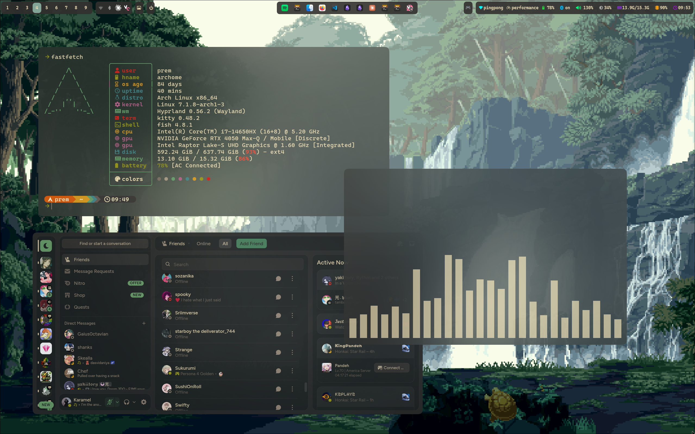
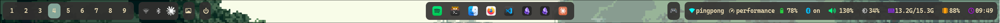

# karamel's gruvbox rice

my Hyprland setup on Arch. Gruvbox teal, dark, soft.





waybar close up — workspaces on the left, a little media/tray cluster in the middle, then
network/bluetooth/battery/clock on the right. kept it minimal on purpose, I don't want a
bar that's doing too much.

## the stack

| | |
|---|---|
| OS | Arch Linux |
| WM | Hyprland 0.56 (Wayland) |
| Terminal | kitty |
| Shell | fish |
| Bar | waybar |
| Launcher | rofi |
| Notifications | dunst |
| Lockscreen | [qylock](https://github.com/Darkkal44/qylock) (quickshell-based, not mine — see below) |
| GTK theme | Gruvbox-Teal-Dark-Soft |
| Icons | WhiteSur-Dark |
| Cursor | phinger-cursors-dark |
| Font | CaskaydiaCove Nerd Font |
| Audio viz | cava |
| System info | fastfetch |

CPU's an i7-14650HX, GPU is a 4050 Max-Q, running on a laptop — so a chunk of the hypr
config is fan/perf-mode stuff, not just eye candy.

## blah blah

ssssssssss
## what's actually in here


## installing this

```sh
git clone https://github.com/prem4002/karamels-gruvbox-dotfiles.git
cd karamels-gruvbox-dotfiles
./install.sh
```

Installs packages (native + AUR), stows everything into place, offers to set up the boot
theme, and clones [qylock](https://github.com/Darkkal44/qylock)

## credits

- [Gruvbox-Teal-Dark-Soft](https://www.gnome-look.org) GTK theme — committed directly in
  `gtk-theme/`, it's the actual bytes since it's a specific variant I'm not trying to
  regenerate from scratch every install
- [WhiteSur-icon-theme](https://github.com/vinceliuice/WhiteSur-icon-theme) for icons
- [phinger-cursors](https://github.com/phisch/phinger-cursors) for the cursor
- [qylock](https://github.com/Darkkal44/qylock) by Darkkal44 for the lockscreen — go check
  out the original, it's not something I built

## todo list

need to add more hehe